# Five Nights at ESCOM

Juego estilo *Five Nights at Freddy's* ambientado en ESCOM, hecho en GameMaker: eres el guardia,
sobrevives una noche (10 PM a 6 AM, unos 9 minutos reales) vigilando las cámaras y usando el láser
de la puerta mientras el Prismoso camina hacia tu oficina. La energía se gasta con las cámaras y
el láser.

Este repositorio es el fork de equipo de `gabrielhuav/Five-Nights-at-ESCOM` para la materia
Desarrollo de Aplicaciones Móviles Nativas (ESCOM-IPN). El proyecto base lo hizo Carlos Adrián
Hernández Torres; su video para configurar GameMaker: https://www.youtube.com/watch?v=wNQGLxLh3lc

Equipo: Miguel Ángel Rodríguez Candelario (`TheMike54`), Victor Eduardo Moreno López
(`VictorMoreno-Code`) e Ian Gael Reyna Mendoza (`IanRey692`).

## Entorno

| Herramienta | Versión usada |
|---|---|
| Sistema operativo | Windows 11 |
| GameMaker | **LTS 2026.0.0.16** (runtime 2026.0.0.23) |
| Git | Git for Windows, con `core.longpaths` activado |
| Python (solo para el verificador de la CI) | 3.x con el paquete `json5` |

El juego no usa JDK, Android SDK ni servicios externos: todo corre en la computadora.

## Ejecutar desde un clon limpio

1. Instala **Git for Windows** y configura las rutas largas (sin esto el clonado falla):
   ```powershell
   git config --global core.longpaths true
   ```
2. Clona en una carpeta cerca de la raíz del disco, porque algunas rutas de sprites son muy
   largas:
   ```powershell
   mkdir C:\FNAE
   cd C:\FNAE
   git clone https://github.com/TheMike54/Five-Nights-at-ESCOM.git
   ```
3. Instala **GameMaker LTS 2026.0.0.16** desde la página oficial de GameMaker (sección de
   versiones LTS). Al instalar no aceptes actualizar a otra versión.
4. Abre GameMaker.
5. *Open* → `C:\FNAE\Five-Nights-at-ESCOM\Five Nights at ESCOM.yyp`. Debe abrir **sin** pedir
   conversión; si la pide, abriste otra carpeta.
6. Presiona **F5**. Si GameMaker pide **iniciar sesión**, entra con tu cuenta de GameMaker (sin
   sesión no ejecuta). La primera compilación tarda unos minutos; al terminar aparece el menú del
   juego.

Al elegir *Nuevo Juego* empieza la noche en la oficina, con la hora arriba a la izquierda y la
batería abajo a la derecha (capturas de Ian Gael Reyna Mendoza, caso 1 de `docs/pruebas.md`):

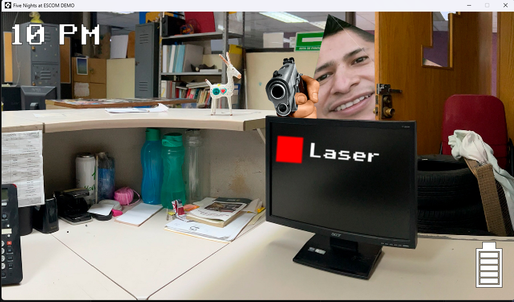

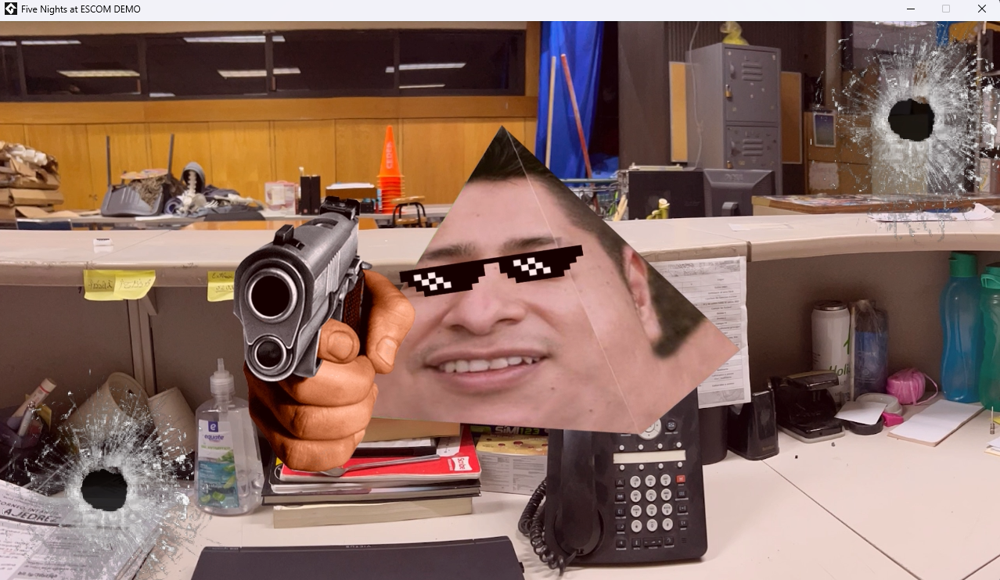

## Problemas de la primera ejecución

### Miguel Ángel Rodríguez Candelario

| Problema | Qué se intentó | Solución |
|---|---|---|
| El clonado falla con `Filename too long`: varias rutas de sprites pasan el límite de 260 caracteres de Windows | — | `git config --global core.longpaths true` y clonar en una ruta corta (`C:\FNAE`) |
| El proyecto venía en GameMaker 2022.0.3.85. Esa versión instala y abre el proyecto, pero **ya no permite iniciar sesión** con cuentas actuales: el inicio de sesión desde el navegador termina en tiempo de espera y el formulario antiguo rechaza cuentas sin contraseña | Cambiar de navegador predeterminado; el formulario antiguo con correo; restablecer la contraseña (la página de GameMaker dio error) | Ninguna en la 2022: es un problema del servicio de inicio de sesión de GameMaker con versiones viejas |
| Sin sesión el IDE deja editar pero no ejecutar | — | Usar **GameMaker LTS 2026.0.0.16** |
| Al abrir el proyecto en la 2026 pide convertirlo a un formato nuevo | — | Aceptar. La conversión tarda unos 30 s y solo reescribe metadatos (`.yyp` y `.yy`); no cambia código, sprites, sonidos ni video. Se integró en su propio Pull Request antes de cualquier otro cambio, para que el equipo clone ya el formato nuevo |

Resultado: el juego compila y corre completo (menú, oficina, cámaras, láser y video del jumpscare).

GameMaker 2022.0.3.85 se queda en la ventana de inicio de sesión:

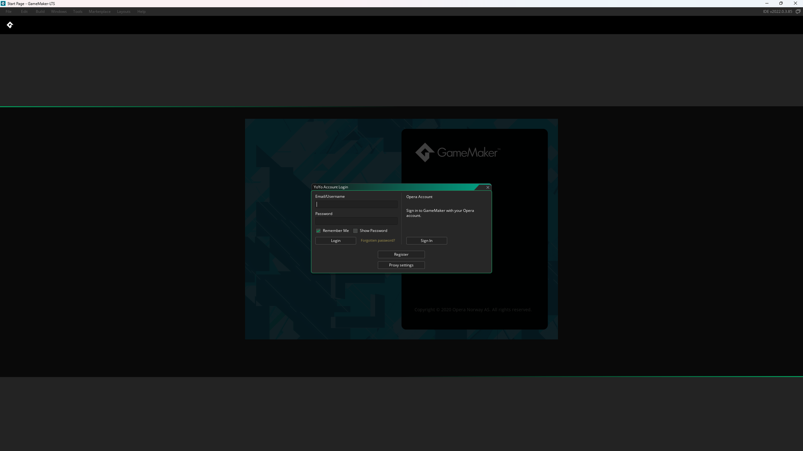

En la LTS 2026 aparece el aviso de conversión y la herramienta de proyecto la hace:

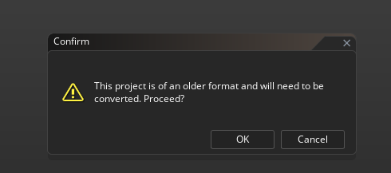

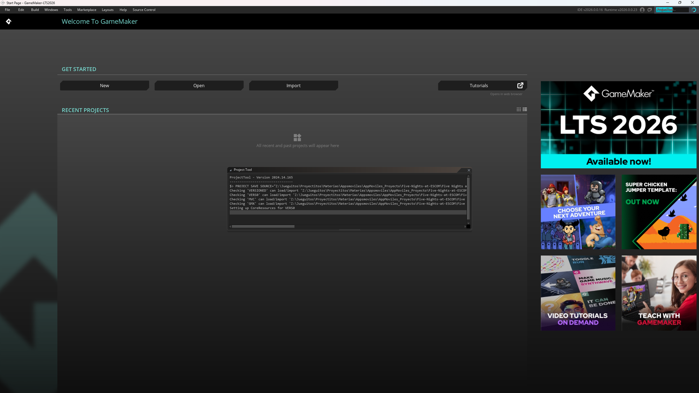

Ya convertido, el juego corre desde el IDE:

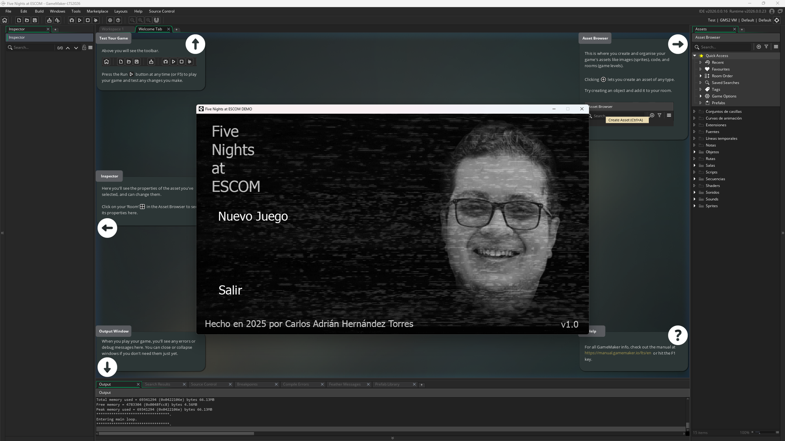

Captura de ejecución con la cuenta de Git configurada:

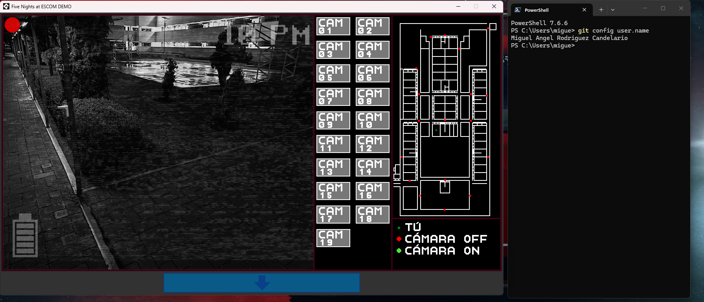

### Víctor Moreno López

| Problema | Qué se intentó | Solución |
|---|---|---|
| Al verificar el instalador de GameMaker con `Get-FileHash .\GameMaker-Installer-2026.0.0.16.exe -Algorithm SHA256`, PowerShell respondió que no encontraba el archivo | Correr el mismo comando otra vez | La terminal estaba abierta en otra carpeta y `.\` busca el archivo en la carpeta actual: el comando se corre en la carpeta donde se descargó el instalador. La versión instalada se confirmó en el propio IDE (v2026.0.0.16, runtime 2026.0.0.23) |
| Al abrir GameMaker LTS 2026 se eligió *Nuevo* y apareció la pantalla para crear un proyecto nuevo ("Select project type") | — | Cerrar ese panel y usar *Abrir* → `Five Nights at ESCOM.yyp` |

Resultado: el juego compila y corre (menú, oficina, cámaras, láser, jumpscare y la regla de energía con el apagón).

`Get-FileHash` corrido desde `C:\WINDOWS\System32`, donde no está el instalador:

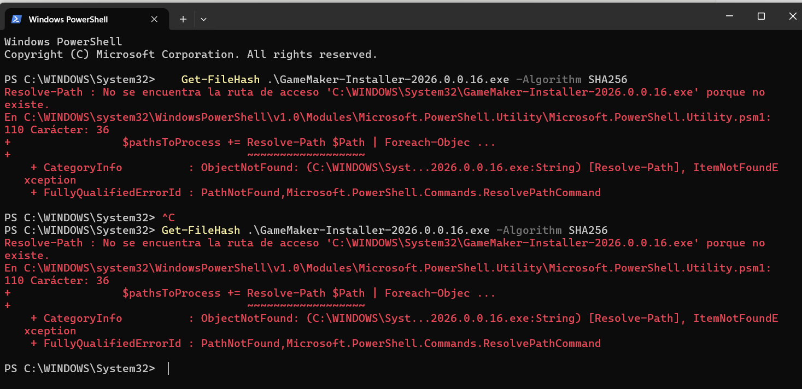

La pantalla que abre *Nuevo* en lugar de *Abrir*:

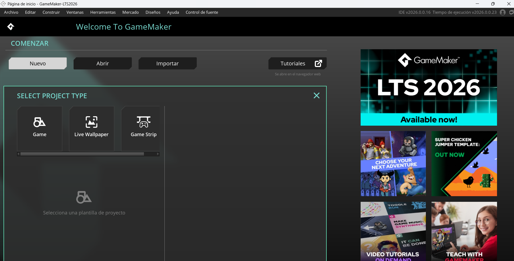

Captura de ejecución con la cuenta de Git configurada:

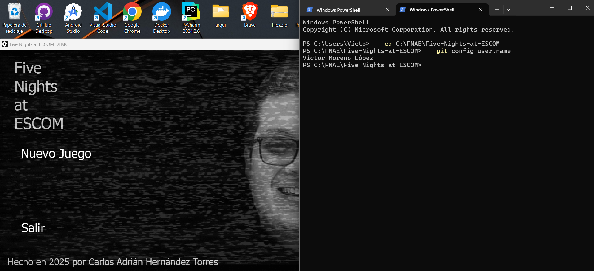

### Ian Gael Reyna Mendoza

| Problema | Qué se intentó | Solución |
|---|---|---|
| Al abrir `Five Nights at ESCOM.yyp` en GameMaker LTS 2026.0.0.16 apareció el aviso "This project is of an older format and will need to be converted" | Cancelar la conversión, porque la carpeta estaba en una rama que todavía tenía el formato 2022 | Cambiar a la rama con la conversión (`gh pr checkout 1`): el proyecto abrió sin pedir conversión y corrió con F5. Con la conversión ya integrada en `main`, un clon nuevo abre sin este aviso |

Resultado: el juego compila y corre; los casos probados están en `docs/pruebas.md`.

Captura de ejecución con la cuenta de Git configurada:

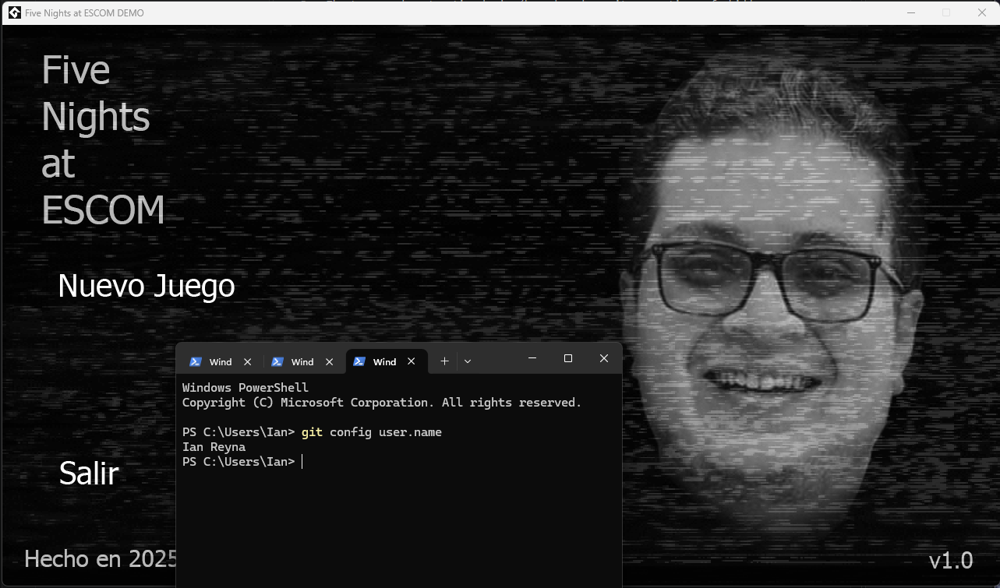

## Integración continua

`.github/workflows/ci.yml` corre en cada Pull Request hacia `main` y en cada push a `main`.
GameMaker no se puede compilar en GitHub Actions (necesita el IDE y una sesión iniciada), así que la
CI hace verificaciones automáticas y la ejecución del juego queda como QA manual en cada PR.

| Check | Qué verifica |
|---|---|
| Convenciones de rama y commits | Ramas `feature/`, `fix/`, `docs/` o `chore/`; mensajes `tipo: descripción` con intención técnica |
| Archivos prohibidos y tamaños | Que no se suban llaves, archivos de firma ni `.env`, y ningún archivo de más de 50 MB |
| Búsqueda de secretos | Tokens o contraseñas en el historial (gitleaks) |
| Proyecto GameMaker legible | Que el `.yyp` y los `.yy` se puedan leer, que cada evento tenga su `.gml` y que la energía inicial no tenga valores de prueba |

Queda como **QA manual**: compilar con F5 y jugar los casos de `docs/pruebas.md`.

## `.gitignore`

El repositorio base no tenía `.gitignore`. El nuestro excluye, entre otros: configuración personal de Claude
Code (`CLAUDE.local.md`), secretos y archivos de firma (`.env`, `*.jks`, `*.keystore`, `*.pem`,
`*.key`, `*.p12`), exportaciones del juego (`*.apk`, `*.aab`, `*.yyz`, `*.zip`) y archivos del
sistema o del editor (`Thumbs.db`, `.vscode/`, `*.tmp`). Los secretos nunca deben versionarse, y
las exportaciones se generan desde el proyecto, así que no hace falta guardarlas.

## Documentación

- `docs/idea.md`: nuestra idea de aplicación propia (Parte 1).
- `docs/arquitectura.md`, `docs/pruebas.md` y `docs/licencias.md`: arquitectura, pruebas y
  licencias del proyecto.
- `docs/evidencia/entrega-1/`: una captura por integrante con el juego corriendo.

Diagrama de arquitectura (explicado en `docs/arquitectura.md`):


## Entrega 1

La característica de la Parte 3 (la ronda termina al agotarse la energía) se puede recorrer de
principio a fin:

| Paso | Liga |
|---|---|
| Issue con el criterio de aceptación | [#2](https://github.com/TheMike54/Five-Nights-at-ESCOM/issues/2) |
| Pull Request, con la descripción en inglés y la evidencia de QA | [#5](https://github.com/TheMike54/Five-Nights-at-ESCOM/pull/5) |
| Ejecución de la integración continua del PR | [CI #20](https://github.com/TheMike54/Five-Nights-at-ESCOM/actions/runs/37255605132) |
| Etiqueta del commit integrado | [`parcial-1`](https://github.com/TheMike54/Five-Nights-at-ESCOM/releases/tag/parcial-1) |

### La regla en el juego

Antes del cambio, al llegar la energía a 0 la noche seguía y se podía ganar sin energía. Con
`obj_EnergyRule`, la pantalla se apaga unos 3 segundos y la ronda termina en el game over
(capturas de Víctor Moreno López, casos F1 a F6 de `docs/pruebas.md`):

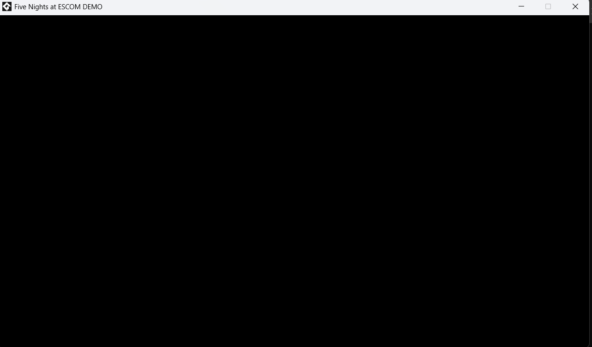

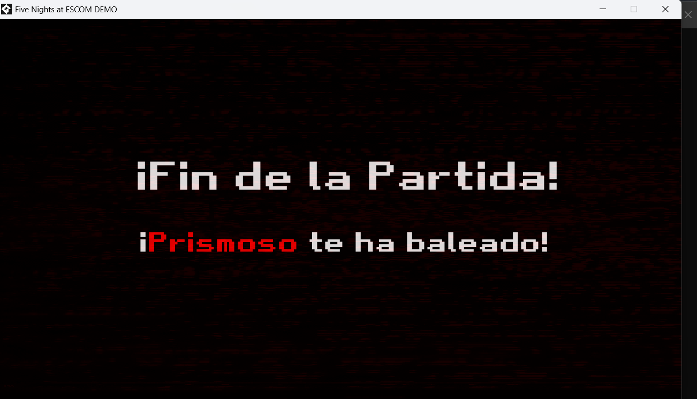

### Historial de commits del PR

Los tres integrantes tienen commits de lógica y de su captura de ejecución.

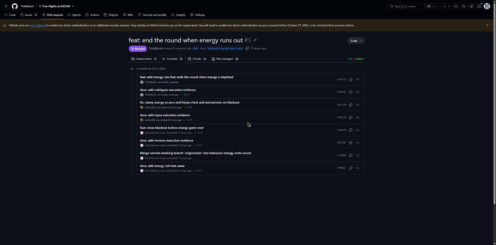

### Integración continua

Los cuatro checks en verde sobre el último commit del PR.

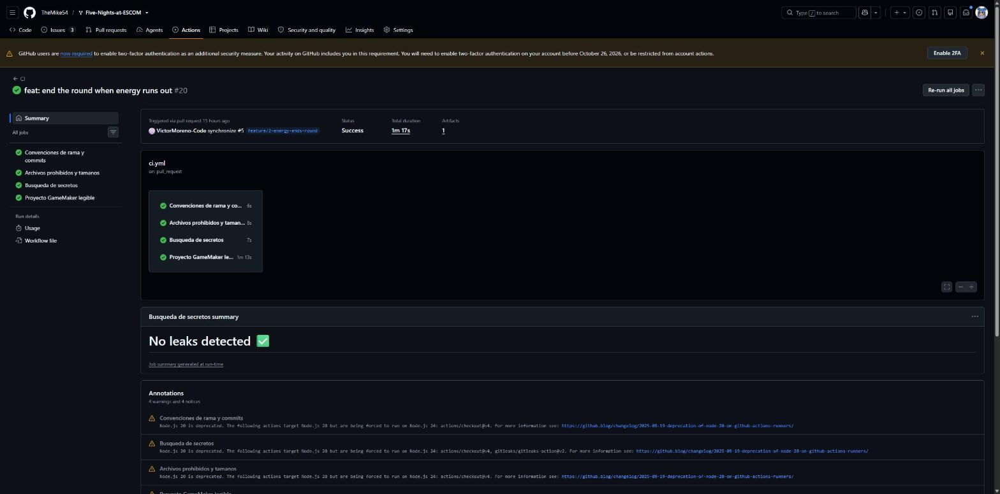

### Conversación de revisión

Comentario de Ian sobre `objects/obj_EnergyRule/Create_0.gml` con su prueba del caso F2, y la
respuesta del autor.

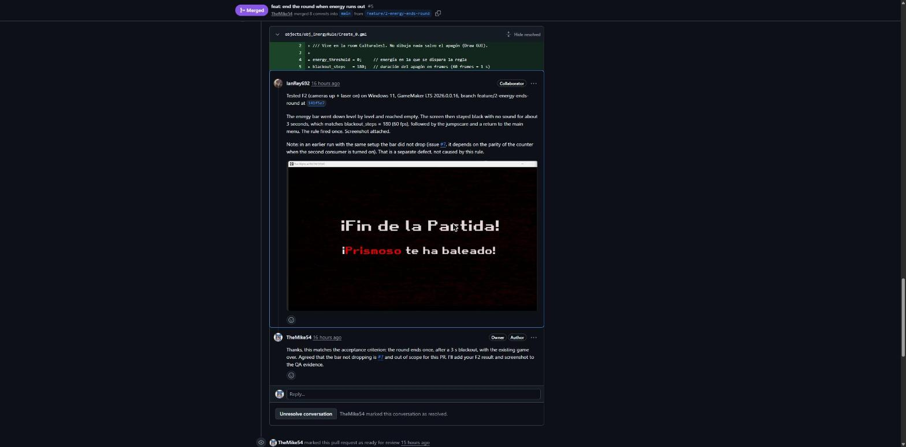
