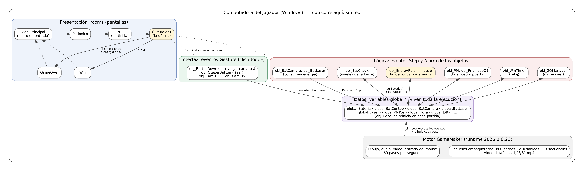

# Arquitectura de Five Nights at ESCOM

Five Nights at ESCOM es un juego de GameMaker en el que el jugador es el guardia de ESCOM y debe
sobrevivir una noche (de 10 PM a 6 AM, unos 9 minutos reales) mientras el Prismoso camina hacia la
puerta. Para vigilarlo tiene cámaras y un láser que lo regresa a su punto de inicio, y ambos gastan
energía. Este documento explica cómo está organizado el repositorio, cómo está construido el juego y
cómo funciona la energía de principio a fin.

## 1. Estructura del repositorio

| Carpeta o archivo | Qué contiene |
|---|---|
| `Five Nights at ESCOM.yyp` | Índice del proyecto: lista todos los recursos y el orden de las rooms. Lo escribe el IDE |
| `Five Nights at ESCOM.resource_order` | Orden en que el IDE muestra los recursos |
| `objects/` | 81 objetos. Cada objeto es una carpeta con su `.yy` (metadatos y lista de eventos) y un `.gml` por evento |
| `rooms/` | 10 rooms (pantallas del juego); su `.yy` lista las instancias de objetos que contiene |
| `sprites/` | 860 sprites (imágenes y animaciones) |
| `sounds/` | 210 sonidos |
| `sequences/` | 13 secuencias (animaciones prearmadas, como la cortinilla de la noche) |
| `datafiles/` | Archivos que se empaquetan tal cual: el video del jumpscare `vd_PSJS1.mp4` |
| `options/` | Configuración por plataforma; `main` define 60 pasos por segundo y `windows` el nombre del ejecutable |
| `.github/` | Integración continua: `workflows/ci.yml` y el verificador `scripts/check_gamemaker.py` |
| `docs/` | Documentación del proyecto: arquitectura, pruebas, licencias, idea propia y evidencias |

El proyecto no tiene scripts ni funciones propias: toda la lógica está en los eventos de los
objetos. Casi todos los objetos se programaron con bloques (*Drag and Drop*); GameMaker guarda los
bloques en un `.dnd` y genera el `.gml` a partir de ellos.

**Punto de entrada.** El juego arranca en la primera room del `RoomOrderNodes` del `.yyp`:
`MenuPrincipal`. Desde ahí el flujo es `MenuPrincipal` → `Periodico` → `N1` (cortinilla) →
`Culturales1` (la oficina, donde está toda la jugabilidad) → `GameOver` o `Win` → de vuelta al menú.
Las rooms `N2`, `N134`, `N1345` y `Guardia` existen en el proyecto, pero ninguna otra room lleva a
ellas.

**`.gitignore`.** El repositorio original no tenía. El nuestro excluye:

- La configuración personal de cada integrante (`CLAUDE.local.md`, `.claude/settings.local.json`,
  `pr-body.md`): es de cada quien y no forma parte del proyecto.
- Secretos y archivos de firma (`.env`, `*.jks`, `*.keystore`, `*.pem`, `*.key`, `*.p12`,
  `google-services.json`, `local.properties`): nunca deben quedar en el historial.
- Exportaciones y compilados (`*.apk`, `*.aab`, `*.yyz`, `*.zip`): se generan desde el proyecto.
- Archivos del sistema operativo y de los editores (`Thumbs.db`, `Desktop.ini`, `.DS_Store`,
  `.vscode/`, `.idea/`, `*.bak`, `*.tmp`).

**Integración continua.** `.github/workflows/ci.yml` corre en cada Pull Request hacia `main` y en
cada push a `main`. GameMaker no se puede compilar en GitHub Actions, porque necesita el IDE y una
sesión iniciada, así que la CI revisa lo que sí se puede revisar sin compilar:

| Check | Qué comprueba |
|---|---|
| Convenciones de rama y commits | Que la rama empiece con `feature/`, `fix/`, `docs/` o `chore/`, y que cada mensaje tenga la forma `tipo: descripción` |
| Archivos prohibidos y tamaños | Que no se suban llaves, archivos de firma ni `.env`, y ningún archivo de más de 50 MB |
| Búsqueda de secretos | Que no haya tokens ni contraseñas en el historial |
| Proyecto GameMaker legible | Con `check_gamemaker.py`: que el `.yyp` y todos los `.yy` se puedan leer, que cada recurso del índice exista, que cada evento de un objeto tenga su `.gml` y que cada instancia de una room apunte a un objeto que existe. También que la energía inicial siga en `global.Bateria = 14400;` |

Lo que la CI no puede comprobar queda como **QA manual** en cada Pull Request: abrir el proyecto en
GameMaker, compilar con F5 y jugar los casos de `docs/pruebas.md`.

**Licencias.** La licencia del código y la procedencia de los recursos están en `docs/licencias.md`.

## 2. Arquitectura



GameMaker no separa el código en capas formales, pero las responsabilidades sí están repartidas:

| Parte | Dónde vive | Ejemplos |
|---|---|---|
| **Presentación** | Rooms, sprites, sonidos y secuencias | `Culturales1` (la oficina), `spr_Bat1` … `spr_Bat6` (la barra de energía) |
| **Interfaz** (entrada del jugador) | Eventos `Gesture` (clic o toque) de los botones y la posición del mouse para mover la vista | `obj_ButtonDown` sube y baja las cámaras; `obj_CLaserButton` prende el láser; `obj_Cam_01` … `obj_Cam_19` cambian de cámara |
| **Lógica** | Eventos `Step` (cada paso) y `Alarm` (cuentas regresivas) | `obj_BatCheck` revisa la energía; `obj_PM` mueve al Prismoso; `obj_WinTimer` avanza la hora |
| **Datos** | Variables `global.*`, que viven mientras el juego esté abierto aunque se cambie de room | `global.Bateria`, `global.Hora`, `global.PMPos`; `obj_Coco` las reinicia en cada partida nueva |

Los objetos no se llaman entre sí: se comunican escribiendo y leyendo variables globales. Por
ejemplo, el botón de cámaras pone `global.BatCamara = 1` y otro objeto, `obj_BatCamara`, ve esa
bandera y resta energía.

**Dependencias.** Ninguna externa: no hay bibliotecas, extensiones ni servicios. Todo lo que usa el
juego viene del propio motor de GameMaker (dibujo, audio y `video_open` para el jumpscare).

**Qué corre en el dispositivo.** Todo. El juego no usa red, no guarda partidas y no lee archivos
externos: el motor ejecuta los eventos 60 veces por segundo en la computadora del jugador y los
recursos van empaquetados en el ejecutable.

## 3. Recorrido de una funcionalidad: la energía

La energía es un contador que empieza en 14 400 y baja 1 por cada paso (1/60 de segundo) que esté
activo un consumidor: las cámaras arriba o el láser encendido. Con un consumidor dura 4 minutos;
con los dos, 2 minutos.

**1. Inicio.** Al entrar a la oficina, `objects/obj_Culturales1/Create_0.gml` llena la energía y la
barra:

```gml
global.Bateria = 14400;
global.BatLaser = 0;
global.BatConteo = 5;
global.BatCamara = 0;
```

**2. Activación.** Al tocar el botón del láser, `objects/obj_CLaserButton/Gesture_0.gml` prende la
bandera del consumidor, pero solo si todavía queda energía en la barra (`obj_ButtonDown` hace lo
mismo con `global.BatCamara` para las cámaras):

```gml
if(global.BatConteo > 0)
{
	if(global.Laser == 0)
	{
		audio_play_sound(snd_Laser, 0, 1, 1.0, undefined, 1.0);
		global.Laser = 1;
		global.BatLaser = 1;
		...
	}
	else { ... global.Laser = 0; global.BatLaser = 0; ... }
}
else
{
	audio_play_sound(snd_EmptyButton, 0, 0, 1.0, undefined, 1.0);
}
```

**3. Consumo.** En cada paso, `objects/obj_BatCamara/Step_2.gml` resta 1 si las cámaras están
arriba. `obj_BatLaser` es idéntico para el láser, por eso con los dos activos la energía baja 2 por
paso:

```gml
if(global.BatCamara == 1)
{
	global.Bateria = global.Bateria-1;
}
```

**4. Niveles y agotamiento.** `objects/obj_BatCheck/Step_2.gml` compara la energía con valores
exactos: cada 2 880 unidades baja un nivel de la barra, y en 0 apaga cámaras y láser:

```gml
var l0184DB3D_0 = global.Bateria;
switch(l0184DB3D_0)
{
	case 0:
		audio_stop_sound(snd_Laser);
		global.BatConteo = 0;
		global.blockCam = 0;
		global.Laser = 0;
		global.BatCamara = 0;
		global.BatLaser = 0;
		global.CambioCamara = 0;
		global.CameraUp = 0;
		...
		break;
	case 2880:  global.BatConteo = 1; break;
	case 5760:  global.BatConteo = 2; break;
	case 8640:  global.BatConteo = 3; break;
	case 11520: global.BatConteo = 4; break;
}
```

**5. Barra.** `objects/obj_Bat/Step_2.gml` lee `global.BatConteo` y muestra el sprite del nivel;
en 0 se muestra la batería vacía.

**Lo que pasaba al llegar a 0.** Nada más: cámaras y láser quedaban inertes, pero el Prismoso
seguía caminando y el reloj seguía, así que todavía se podía ganar a las 6 AM sin energía. Además,
como la comparación es exacta y con dos consumidores la energía baja de 2 en 2, el contador puede
saltarse el 0 y quedar negativo, y entonces la barra nunca llega a vacía.

**Qué archivos cambian para que la ronda termine al agotarse la energía.** En lugar de editar
`obj_BatCheck` (que está hecho con bloques y cuyos diffs serían difíciles de revisar), se agregó un
objeto nuevo escrito en GML:

| Archivo | Cambio |
|---|---|
| `objects/obj_EnergyRule/obj_EnergyRule.yy` | Objeto nuevo con cuatro eventos |
| `objects/obj_EnergyRule/Create_0.gml` | Umbral de energía y duración del apagón (180 pasos = 3 s) |
| `objects/obj_EnergyRule/Step_1.gml` | Corrige la energía negativa antes de que nadie la lea |
| `objects/obj_EnergyRule/Step_0.gml` | Detecta el 0, apaga controles y sonido, congela el reloj y al Prismoso, y al terminar el apagón manda al game over |
| `objects/obj_EnergyRule/Draw_64.gml` | Dibuja la pantalla negra del apagón |
| `rooms/Culturales1/Culturales1.yy` | Coloca una instancia del objeto en la oficina |
| `Five Nights at ESCOM.yyp` y `.resource_order` | Registran el objeto nuevo |

No se modificó ningún archivo existente de lógica: el objeto nuevo lee y escribe las mismas
variables globales que ya usaba el juego.
