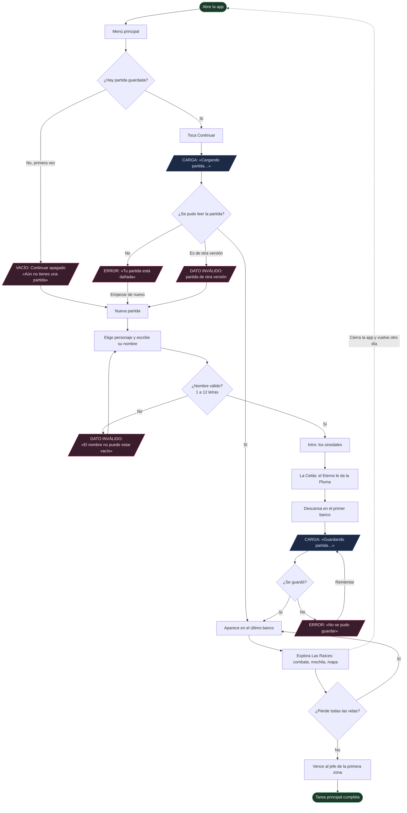
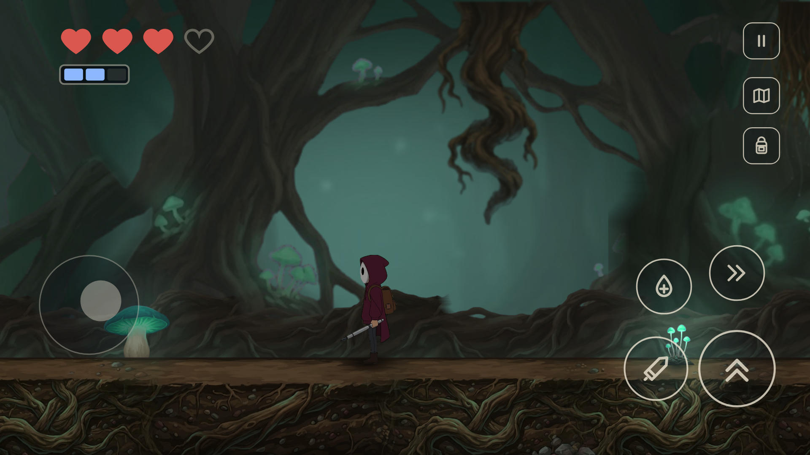
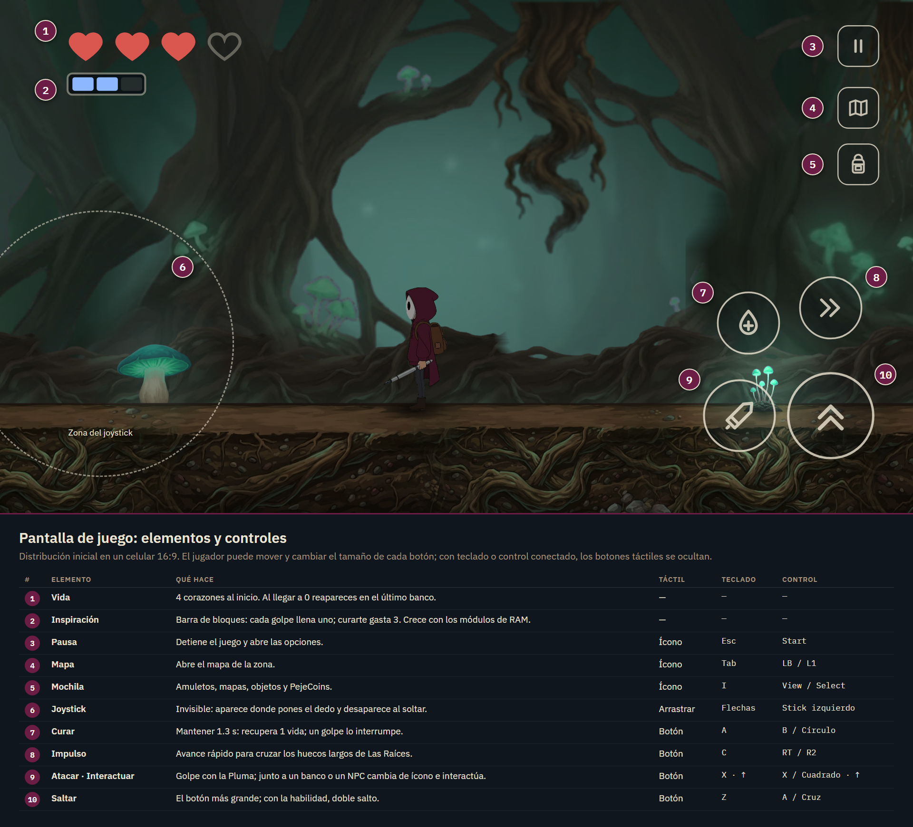
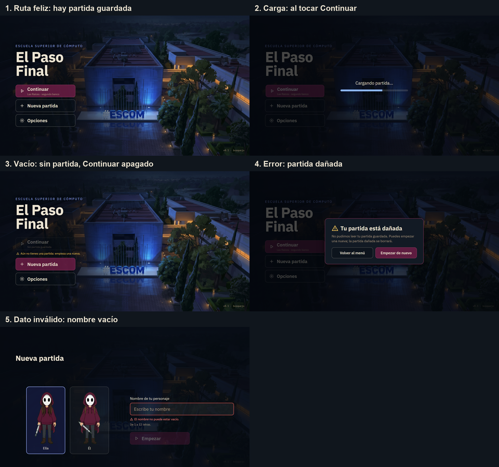
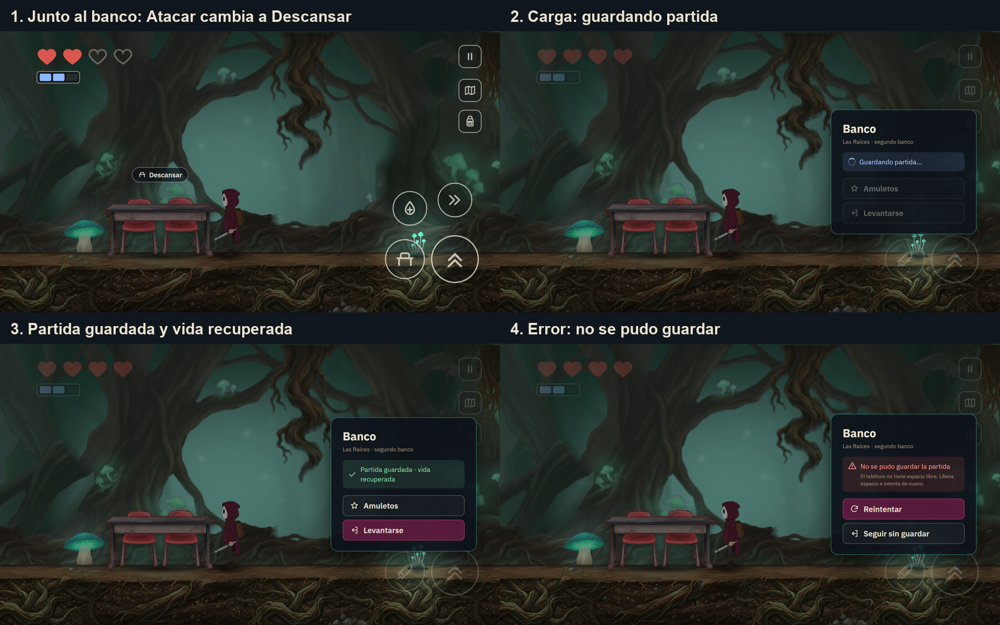
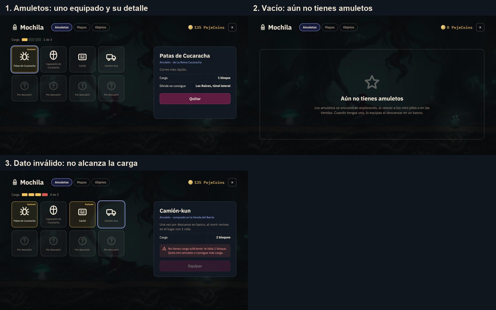
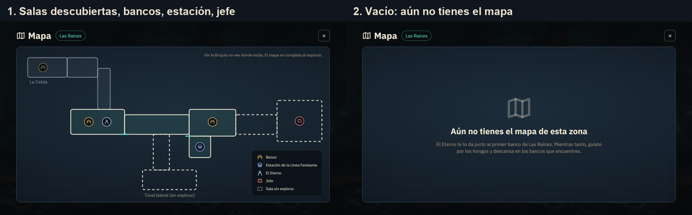

# Idea original: El Paso Final

Equipo: Miguel Ángel Rodríguez Candelario, Victor Eduardo Moreno López e Ian Gael Reyna Mendoza · Desarrollo de Aplicaciones Móviles
Nativas · ESCOM-IPN · Entrega 1 del proyecto.

*El Paso Final* es un juego de plataformas y exploración en 2D para celulares Android, al estilo de Hollow
Knight. Un alumno de ESCOM se queda dormido ensayando su presentación de Trabajo Terminal y despierta
debajo de la escuela: para titularse tiene que subir, zona por zona, hasta su salón y vencer a los tres
sinodales que le cierran el paso.

## 1. Ficha de la idea

| Campo | Contenido |
|---|---|
| Ruta elegida y motivo | Elegimos Five Nights at ESCOM porque nos pareció divertido y nos llamó la atención cómo maneja las cámaras. |
| Usuario y contexto | Alumnos de ESCOM, empezando por nuestros amigos y los de los compañeros del equipo, que juegan en su celular Android en ratos cortos: entre clases o en el transporte público. |
| Problema observable | En los ratos libres entre clases o en el metro, los alumnos de ESCOM buscan algo para entretenerse desde su celular. |
| Alternativa actual | Revisan redes sociales o juegan otros juegos. |
| Tarea principal | Avanzar y descubrir zonas, al estilo Hollow Knight, guardando en bancos para continuar en otro momento. |
| Criterio de éxito | Una persona que nunca lo ha jugado entiende los controles sin que nadie le explique y vence al jefe de la primera zona. |
| Alcance de la primera versión | El juego completo es ambicioso; por eso la primera versión se limita a las dos primeras zonas. Ver la tabla de abajo. |
| Funciones aplazadas | Ver la lista de abajo. |
| Hipótesis pendiente de validar | Creemos que los alumnos de ESCOM jugarían El Paso Final para entretenerse en sus ratos libres. Todavía no lo hemos comprobado. |

### Alcance de la primera versión

| Área | Entra |
|---|---|
| Inicio | Elegir personaje (mujer u hombre) y escribir su nombre; menú con Nueva partida y Continuar, con estados de carga, vacío, error y dato inválido |
| Historia | Intro con imágenes fijas y escena de los sinodales |
| Zonas | La Celda y Las Raíces completas: tres enemigos, raíces con espinas, un mini jefe opcional y el jefe de la zona |
| Progresión | La habilidad de impulso, el arma base y un amuleto |
| Sistemas | Cuatro vidas, curación, bancos y guardado, mochila, y un reto de preguntas para recuperar lo perdido al morir |
| Personajes | Un personaje guía que entrega el arma y el mapa de la primera zona |
| Celular | Controles táctiles personalizables y modo de bajo detalle para teléfonos de gama baja |
| Desarrollo | Zona de pruebas básica: pasillo de mecánicas, arena de jefes y panel de trucos |

### Funciones aplazadas de forma deliberada

Las zonas 2 a 6 y el final con los sinodales; las demás habilidades; la tienda y el minijuego de apuestas;
las mejoras del arma; el viaje rápido entre estaciones; los personajes secundarios restantes; la música
completa; el fondo animado del menú.

## 2. Historia de usuario y criterio de aceptación

**Historia:** Como alumno de ESCOM con ratos libres cortos, quiero explorar el mundo bajo la escuela en
sesiones de pocos minutos y retomar donde me quedé, para entretenerme sin perder mi avance.

**Criterio de aceptación:** Dado que descansé en un banco y cerré la app, cuando la vuelvo a abrir y toco
Continuar, entonces aparezco en ese mismo banco con las mismas vidas y las mismas habilidades.

## 3. Recorrido del usuario

Desde que abre la app hasta que cumple la tarea principal. En rosa, los estados que no son la ruta feliz
(vacío, error y dato inválido); en azul, los de carga.

*Figura 1. Diagrama del recorrido del usuario. Elaborado por Ian Gael Reyna Mendoza con ayuda de Claude Code, en Mermaid.
La misma figura en imagen: [`img/idea/06-recorrido.png`](img/idea/06-recorrido.png).*

## 4. Bosquejos de las pantallas

Cinco pantallas fijas en un celular de 16:9. Los textos, botones, corazones e íconos están hechos en
vectores; las ilustraciones son arte de prueba y cambiarán en la versión final.

### 4.1 Pantalla de juego y sus controles

*Figura 2. Pantalla de juego en la primera zona, Las Raíces. Elaborada por Miguel Ángel Rodríguez
Candelario. Arte de prueba generado con Gemini (Nano Banana); escena y controles armados con ayuda de
Claude Code.*

*Figura 3. Esquema de la pantalla de juego: vida, Inspiración (recurso para curarse), pausa, mapa, mochila,
joystick invisible y los cuatro botones de acción, con su equivalente en teclado y control. Elaborado por
Miguel Ángel Rodríguez Candelario con ayuda de Claude Code.*

### 4.2 Menú principal y nueva partida

*Figura 4. Menú principal: ruta feliz, carga al tocar Continuar, vacío (sin partida guardada), error
(partida dañada) y dato inválido (nombre vacío al crear la partida). El fondo, ESCOM de noche vista desde
arriba, es arte de prueba generado con Gemini (Nano Banana) a partir de fotos propias y de cuadros de un
video oficial del IPN usados solo como referencia; las pruebas del fondo animado se hicieron con Google
Flow (Veo). Elaborado por Miguel Ángel Rodríguez Candelario con ayuda de Claude Code.*

### 4.3 Banco

*Figura 5. Banco, el punto donde se guarda la partida y se recupera la vida: junto al banco, carga
(guardando), partida guardada y error al guardar. La mesa con sus sillas es la misma en todas las zonas,
como las bancas de Hollow Knight. Elaborado por Victor Eduardo Moreno López. Arte de prueba generado con Gemini (Nano
Banana); pantalla armada con ayuda de Claude Code.*

### 4.4 Mochila

*Figura 6. Mochila: amuletos con uno equipado, vacío (todavía no hay amuletos) y dato inválido (el amuleto
no cabe en la carga disponible). Elaborado por Victor Eduardo Moreno López con ayuda de Claude Code; íconos provisionales
en vectores.*

### 4.5 Mapa

*Figura 7. Mapa de Las Raíces: salas descubiertas y sin explorar, bancos, estación, personaje guía y jefe;
y vacío, cuando todavía no se tiene el mapa de la zona. Elaborado por Ian Gael Reyna Mendoza con ayuda de Claude Code.*

## 5. Uso de asistentes de IA

| Herramienta | En qué parte |
|---|---|
| Gemini (Nano Banana) | Arte de prueba: fondos y piezas de Las Raíces, personaje, banco y vistas de ESCOM del menú |
| Google Flow (Veo 3.1) y Gemini (Veo) | Pruebas del fondo animado del menú |
| Claude Code | Armado de las pantallas en HTML, recorte de las piezas, diagrama del recorrido y redacción de este documento a partir de las decisiones del equipo |

Las referencias de terceros (cuadros del video oficial del IPN, imagen satelital de Esri) se usaron solo
como guía para el arte y se registran en `docs/licencias.md`.
